.. _zh_tw_chat_dashboard:

=============================
SeaChat 儀表板用戶手冊
=============================

.. contents:: 目錄
    :local:
    :depth: 3

登入頁面
=============================
必須先登入才能使用儀表板的功能，如果使用者未登入時服務將自動跳轉頁面至登入頁面，於登入頁面輸入帳號密碼後登入SeaChat儀表板。
登入頁面的範例圖片如下:

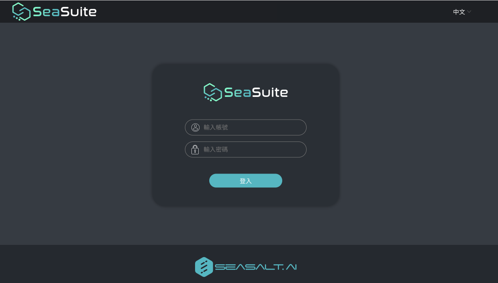

儀表板首頁
=============================
儀表板首頁的圖片如下圖:

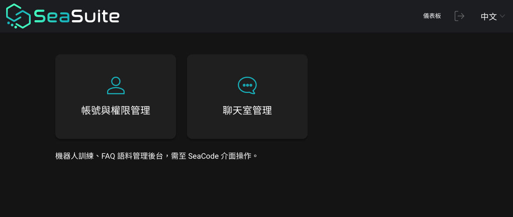

於首頁上可以看到 ``帳號與權限管理`` 與 ``聊天室管理`` 兩個管理功能的入口，接下來將依序說明這兩項目的細部操作。

帳號與權限管理
=============================

於儀表板首頁點擊 ``帳號與權限管理`` 後，頁面將切換到帳號與權限管理的畫面，畫面左側為主選單，用來切換要使用的不同功能，畫面右側為主要的顯示區塊，會顯示目前所選擇功能的操作頁面。

管理 GitHub
-----------------

進入帳號與權限管理頁面後，預設會進入 ``管理GitHub`` 頁面，或者使用者可點選左側選單的 ``管理GitHub項目`` 來切換至管理GitHub頁面，畫面如下所示:

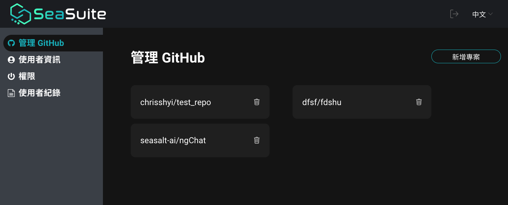

本頁面主要用來維護 SeaChat 系統中，儲存機器人資訊的Git專案連線用ssh金鑰。配合 SeaCode 使用，當使用SeaCode進行機器人模型的訓練時，需將調整的資訊發送到對應的Git專案上，此時觸發訓練模型，SeaChat系統才能由對應的Git專案中取得模型的相關資料並進行訓練。

一般來說設定完成後不需進行調整，避免影響機器人的模型訓練。

使用者資訊
-----------------
``使用者資訊`` 用來管理與檢視SeaChat服務的使用者。透過此頁面的功能，能夠新增使用者、修改使用者資料與權限、刪除使用者。

搜尋使用者
~~~~~~~~~~~~~~~~

於使用者資訊頁面會看到一個使用者列表，如下圖所示

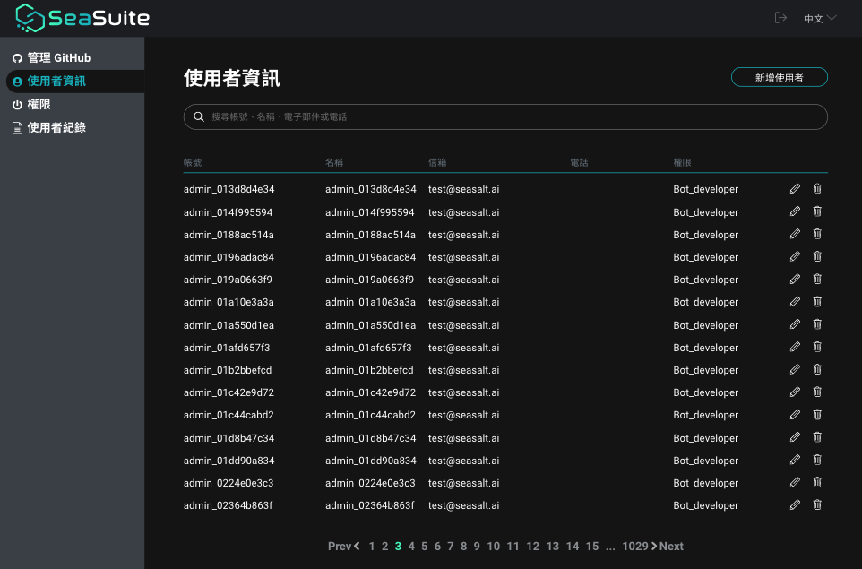

於該列表上方為搜尋列，可輸入任意文字，系統會自動以輸入的文字搜尋使用者的帳號、名稱、電子郵件與電話，只要任一個欄位中包含輸入的文字，該筆紀錄就會顯示於畫面下方，輸入兩個字母以上時系統就會自動開始搜尋，想重新檢索完整資料，只要清除輸入的搜尋文字即可。

下圖為示範進行搜尋的狀況：

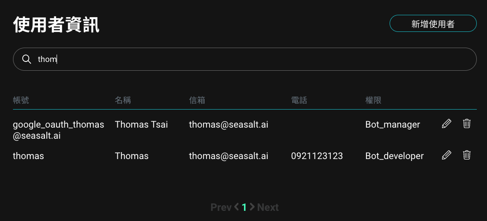

新增使用者
~~~~~~~~~~~~~~~~~
於介面右上角點擊 ``新增使用者`` 按鈕，此時畫面中央會跳出資料輸入的視窗，於視窗中輸入使用者資訊後，並選擇該使用者的權限，按下確認後完成新增。
新增使用者的視窗如下所示：

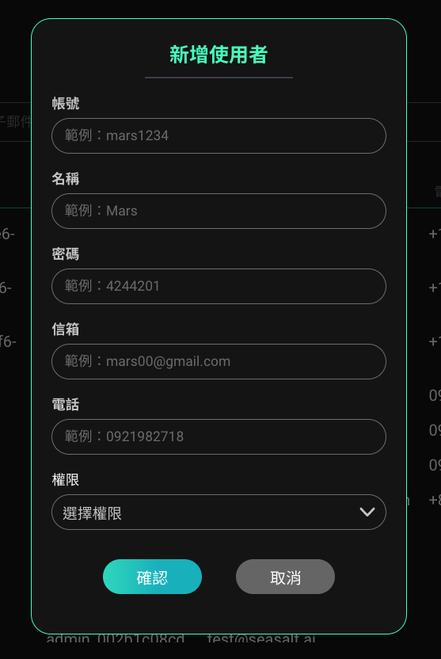

請注意帳號、密碼、權限三個欄位為必填欄位，未輸入時系統會出現提示

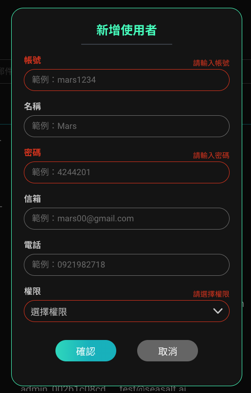

修改使用者
~~~~~~~~~~~~~~~~
於使用者列表中找到要修改的使用者，並點選該筆資料右側的編輯圖案，此時畫面會出現使用者資料的跳窗，編輯內容後按下確認完成修改。
編輯圖案的範例圖片如下：

編輯跳窗的範例圖片如下：

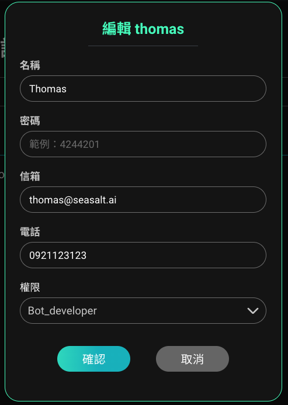

修改時，無法修改 ``帳號`` 欄位，因此介面中不會顯示 ``帳號`` 欄位， ``密碼`` 欄位預設為空白，如果不想重設密碼請保持空白，否則輸入的字串將會成為新的密碼。

刪除使用者
~~~~~~~~~~~~~~
於使用者列表中找到要刪除的使用者，並點選該筆資料右側的刪除圖案，此時畫面會出現確認是否刪除的視窗，按下 ``刪除`` 按鈕後就會將所選的使用者刪除，此時如果不想刪除了只要按下取消即可。

刪除圖案的範例圖片如下：

刪除時確認刪除的跳窗範例圖片如下：

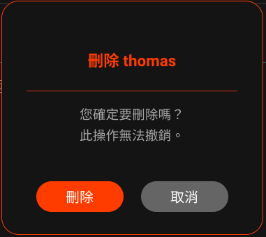

權限
---------------------
``權限`` 頁面是用來管理權限設定的功能， ``使用者資訊`` 頁面在新增與修改使用者時，可指定使用者的 ``權限`` ，此時可以選擇的權限規則便是於此頁面編輯的。
切換至此頁面後，可以看到目前已設定的權限規則列表，如下圖

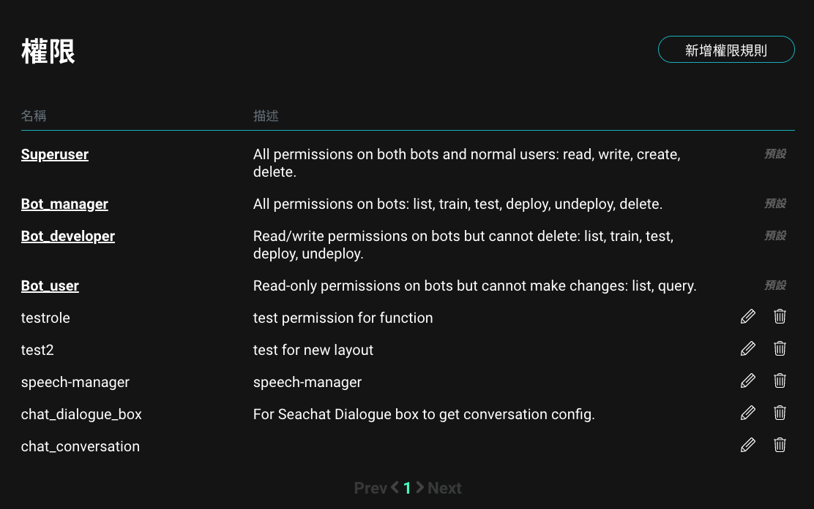

可於此頁面中 新增、修改、刪除 ``權限規則``，不過需注意部分顯示為預設的權限規則是系統設定的，使用者無法對這些權限規則進行異動。

檢視權限規則
~~~~~~~~~~~~~~~~~~
於列表頁面點擊權限規則的名稱，將會切換至檢視權限的頁面此時頁面將如下圖所示：

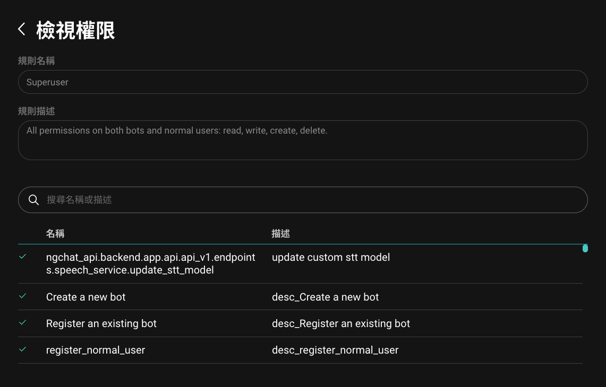

畫面上方會顯示 ``規則名稱`` 與 ``規則描述`` 兩個欄位，下面列表則是顯示該權限規則包含哪些權限，可使用搜尋欄位查詢具備的權限，快速確認此權限規則是否具備期望的權限。

新增權限規則
~~~~~~~~~~~~~~~~~~~~~~
於列表頁面點擊右上角的 ``新增權限規則``，將會切換至新增權限規則的頁面此時頁面將如下圖所示

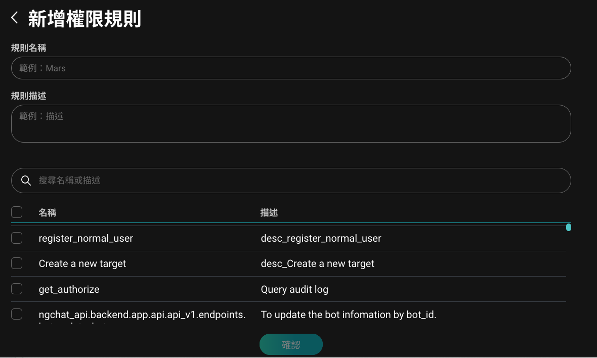

上方區塊可輸入規則名稱與規則描述，規則名稱為必填欄位，未輸入時 ``確認`` 按鈕為停用狀態無法點擊。
需注意規則名稱最長只能有20個字，超過字數將無法儲存。
下方區塊會列出目前系統提供的所有功能選項，於該區塊搜尋想要的項目後勾選設定

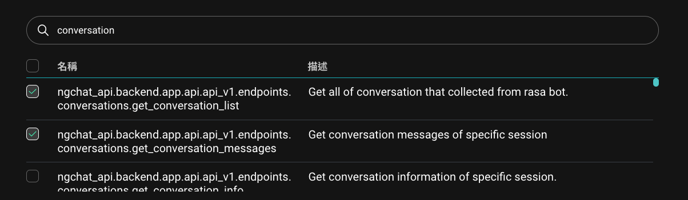

輸入完資料並勾選需要的權限後，按下確定按鈕完成儲存，如果要放棄編輯，可點選左上角的箭頭返回 ``權限規則列表``。

箭頭圖案的範例圖片如下：

修改權限規則
~~~~~~~~~~~~~~~~~~~~~~

於列表中找到要修改的權限政策，並點選該筆資料右側的編輯圖案，此時畫面切換到編輯權限的頁面

編輯圖案的範例圖片如下：

編輯頁面的範例圖片如下：

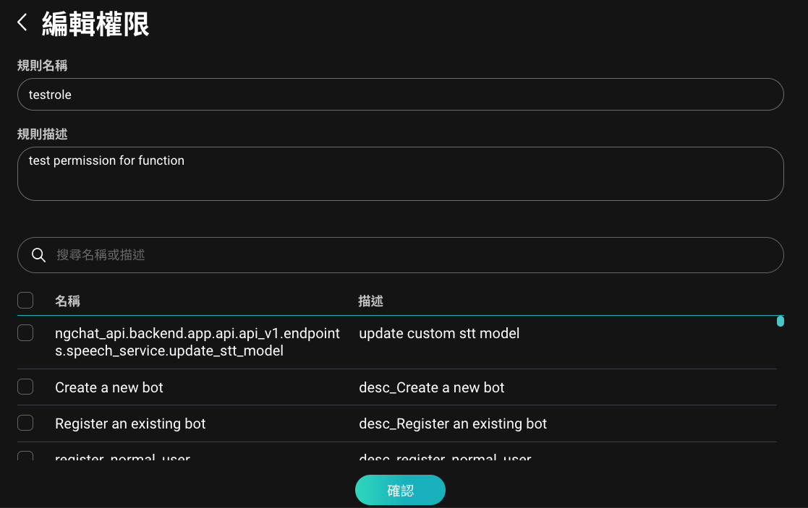

可於此處編輯規則名稱、規則描述以及該規則具備的權限。
編輯後，按下確認即可儲存編輯結，成功編輯會自動返回列表頁，如想放棄編輯，可點擊頁面左上角的箭頭返回 ``權限規則列表``。

箭頭圖案的範例圖片如下：

編輯時，規則名稱不可超過20個字，且編輯後的名稱不可與現有規則相同，否則按下確認後會儲存失敗。

刪除權限規則
~~~~~~~~~~~~~~~~~~~~~~

於列表中找到要刪除的 ``權限規則`` ，並點選該筆資料右側的刪除圖案，此時畫面會出現確認是否刪除的視窗，按下 ``刪除`` 按鈕後就會將所選的權限政策刪除，此時如果不想刪除了只要按下 ``取消`` 即可。

刪除圖案的範例圖片如下：

刪除時確認刪除的跳窗範例圖片如下：

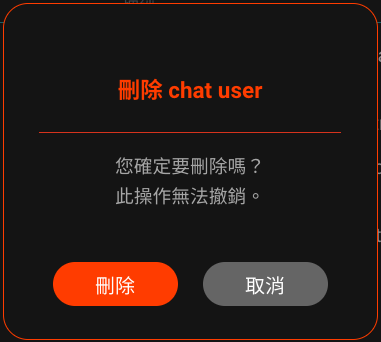

不過需要注意的是，要刪除的權限政策如果已經有指派給任何一個使用者，按下刪除後，將會看到下面的錯誤訊息，此時表示因為此權限政策還在使用中無法刪除

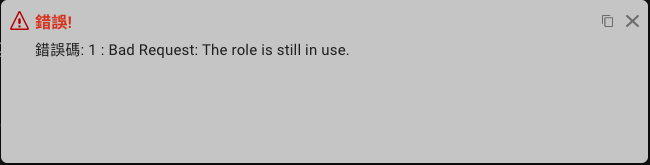

此時必須先修改使用該權限政策的使用者，改為使用其他權限政策，完成後才可刪除此筆紀錄。

使用者紀錄
--------------------

``使用者紀錄`` 頁面可以查詢所有使用者於SeaChat系統上進行的任何操作。
切換至此頁面後，可以看到使用者紀錄的列表頁如下圖所示

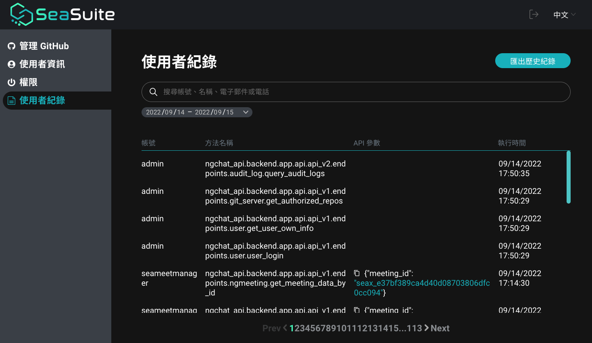

開啟頁面時，預設會先搜尋最近一天資料，可透過上方時間區間的區塊調整要查詢的資料區間，點擊後會出現設定時間區間的跳窗供使用者操作。

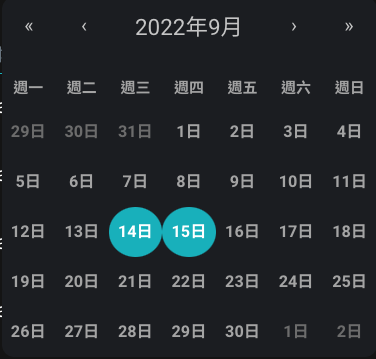

選擇時間區間的方式，請先於想選擇的起始日期上點擊，之後切換日曆到期望的結束日期後再點擊一下即可，選取一段時間後可以看到如下圖所示的畫面。

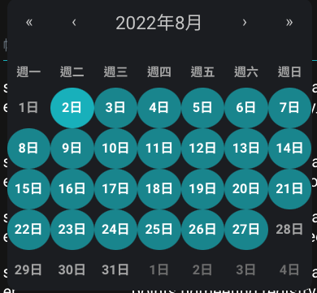

選取完結束日期後系統會自動開始查詢資料

除了可以設定時間區間以外，最上方的輸入格也可輸入想搜尋的文字，輸入文字後，系統會查詢帳號、名稱、電子郵件與電話這四欄位中包含輸入文字的資料。

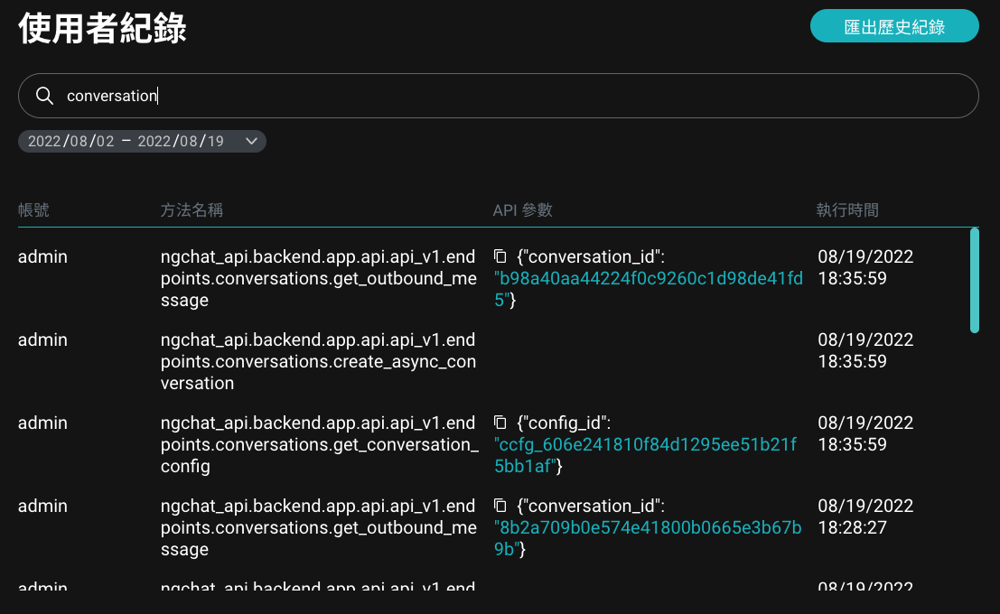

可使用畫面右上角的 ``匯出歷史紀錄`` 按鈕來下載使用者紀錄，會依據目前頁面的搜尋條件來查詢資料並產生檔案供使用者下載。

聊天室管理
=============================

於儀表板首頁點擊 ``聊天室管理`` 後，頁面將切換到聊天室管理頁面，該頁面會列出目前系統中所有的聊天室，使用者可以在這個頁面中選擇要管理的 ``聊天室``。

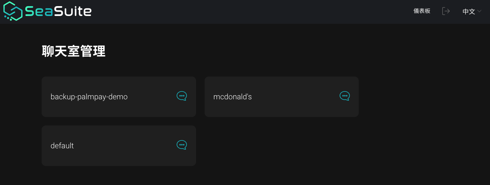

點擊任一個聊天室的牌卡，畫面會切換到所選擇聊天室的 ``牌卡管理`` 頁面

牌卡管理
---------------------------

``牌卡管理`` 用來設定聊天視窗中主選單的按鈕設定，所謂的主選單是當顧客於聊天視窗中點選左下角的選單按鈕時出現的選單

如下圖紅匡所標示的位置，點擊後就會出現六個牌卡，這便是聊天視窗的主選單

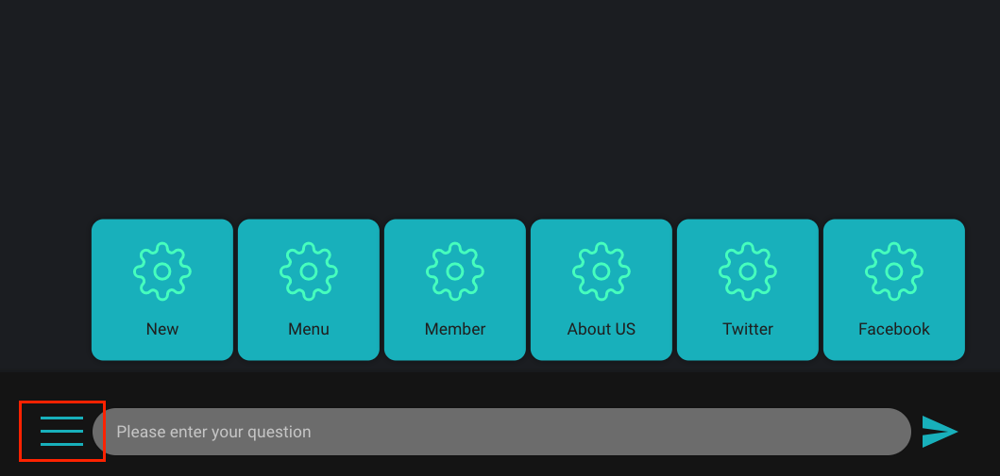

進入編輯頁面時可看到如同下面圖片的畫面。

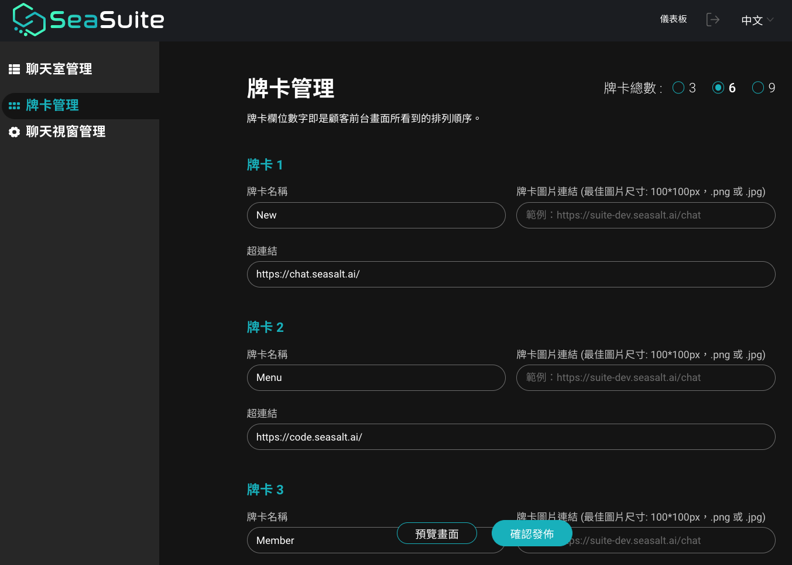

上方範例我們看到六張牌卡，其實目前允許設定3,6,9個牌卡，只要使用畫面上方的選項選擇想啟用的牌卡數量即可，當切換不同數量的牌卡時，畫面下方設定牌卡內容的區域將會發生變動。
依據選擇的數量下方的編輯區塊也一樣會變成3,6,9個。

每張牌卡可以設定名稱、牌卡圖片連結、超連結三個欄位，每張牌卡設定區塊的畫面顯示如下圖：

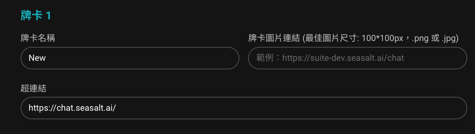

三個欄位的用途說明如下：

1. 牌卡名稱:用來顯示於聊天視窗中選單項目的標題
2. 牌可圖片連結:聊天視窗中選單項目上會顯示此連結設定的圖片
3. 超連結:當顧客於聊天視窗上點擊該選單項目時，會開啟此超連結指定的網頁

設定牌卡後，可使用畫面下方的 ``預覽畫面`` 按鈕，觸發後系統會自動開啟新分頁，並且呈現預覽的畫面

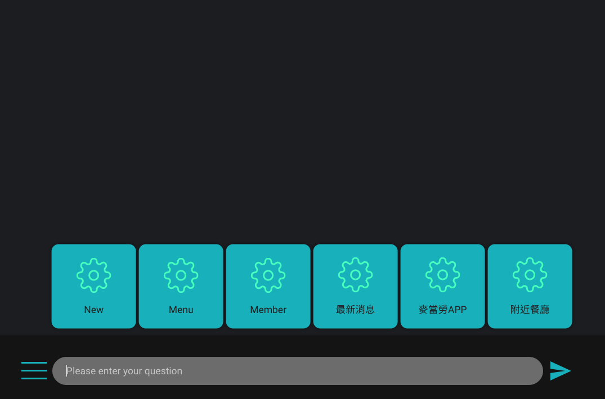

設定完成後，按下 ``確認發布`` 便會儲存變更，新開啟的聊天視窗將會依據設定的內容來呈現主選單。

聊天視窗管理
---------------------------

``聊天視窗管理`` 用來設定聊天視窗的基本資料與頁面風格等，切換至此頁面後，可以看到聊天視窗管理的設定頁面如下圖所示

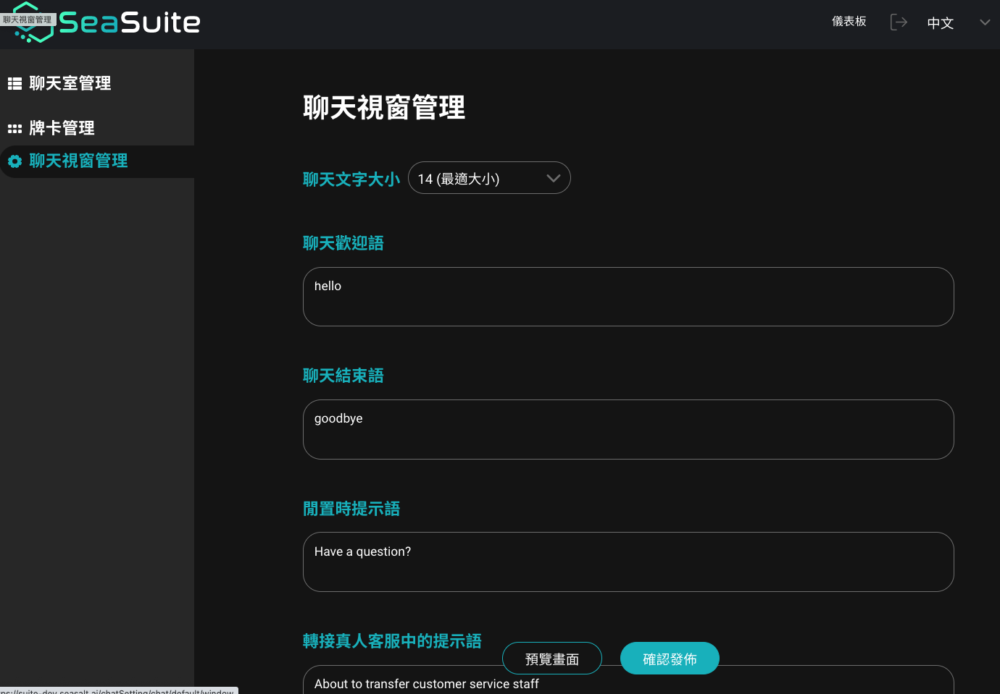

於該頁面分別有下面幾個屬性能夠設定

1. 聊天文字大小:聊天視窗中顯示的文字打小。
2. 聊天歡迎語:當聊天視窗被開啟時，機器人會固定輸出的文字，可用來打招呼。
3. 聊天結束語:當使用者表示要結束對話時，機器人會固定使用此處文案來跟使用者道別。
4. 閒置時提示語:使用者如果間隔一段時間未輸入任何文字，機器人會顯示此欄位設定的文字，用來引起使用者注意，希望使用者能繼續進行對談，閒置時只會出現一次這樣的提醒。
5. 轉接真人客服中的提示語:當系統正在轉接真人客服時，由於需等待真人客服能夠接線，因此會顯示此處的文字避免使用者不知道現在發生什麼事了。
6. 機器人icon連結:聊天視窗中代表機器人的icon。

當設定完成後，可使用畫面下方 ``預覽畫面`` 按鈕，當按下按鈕時，會開啟新視窗讓供使用者預覽設定的結果。

如果預覽沒有問題，可按下 ``確認發佈``，系統將保存資料，之後新開啟的聊天視窗將依據新的設定運作。