.. _zh_tw_sea_code:

=============================
SeaCode 用戶手冊
=============================

.. contents:: 目錄
    :local:
    :depth: 3

總覽
=============================

SeaCode 是用來進行聊天機器人的管理與訓練的 VSCode Extensions，用來協助使用者管理與訓練聊天機器人語意識別模型。
而 SeaChat 聊天機器人的模型資料是透過 Git 來進行版本控管的，因此要使用 SeaCode 來維護聊天機器人的模型需要幾個先決條件

1. 已安裝 Git
2. 已安裝 VSCode
3. 具備聊天機器人模型資料的 Git repository 權限，並且已經 pull 該 repository 於本地環境。

安裝 SeaCode
=============================
確定先決條件的已具備以後，可以開始安裝 SeaCode，有下面兩個方法可以找到 SeaCode

1. 點開下面連結後，點選 ``Install`` 進行安裝，系統會邀請開啟 VSCode 請依循引導進行安裝

https://marketplace.visualstudio.com/items?itemName=SeasaltAI.vscode-seacode

2. 開啟 VSCode 以後，於左側選單中找到 Extensions 項目，並於該介面搜尋 `SeaCode` 看到下圖後選擇 `SeaCode Extension` 並進行安裝

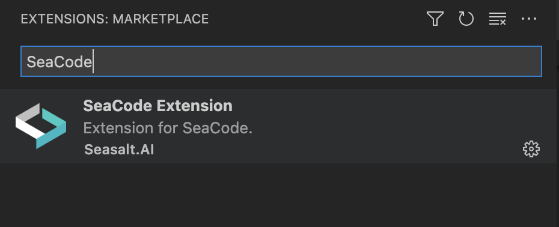

開始使用
==============================

要使用 SeaCode 有下面幾個步驟

開啟聊天機器人專案
----------------------------
要使用 SeaCode 需先讓 VSCode 開啟要編輯的聊天機器人專案，請先於 VSCode 的視窗中開啟機器人專案的目錄，該專案內必定會包含一個 ``bots`` 的資料夾。
請注意這個聊天機器人專案，需與 SeaCode dashboard 中 Git Hub 管理所設定的 ``repository`` 一致，確保 SeaCode 也能取得相同原始碼。

設定 SeaCode
---------------------------- 

我們須調整 SeaCode 的設定檔，使其能連線到 SeaChat 服務。
於 VSCode 找到 Preferences 下的 Settings，可參考下面截圖，不同版本的 VSCode 可能有些許差異。

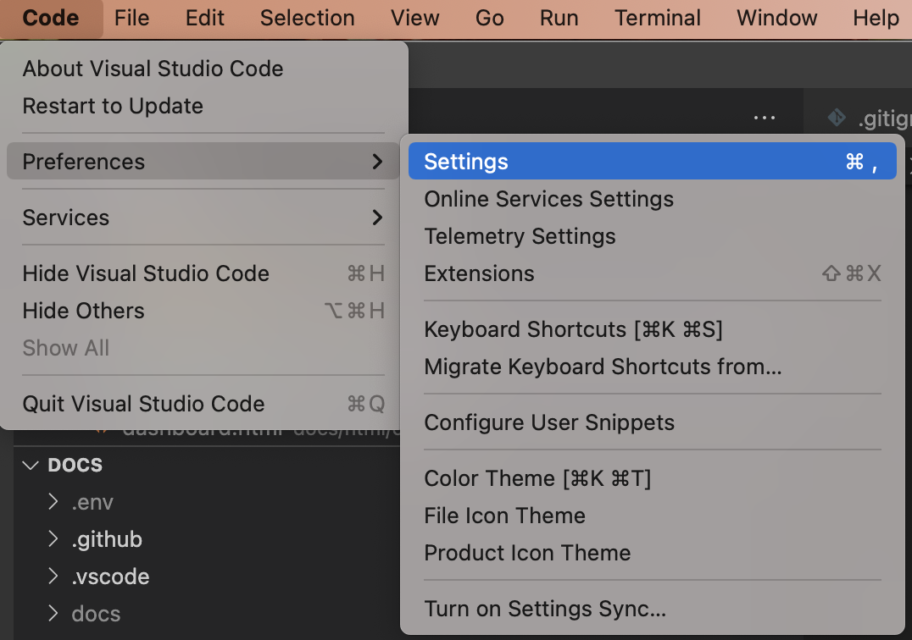

點選 Settings 選項後，將開啟設定頁面，此時於搜尋列輸入 ``SeaCode`` 可以快速找到要設定的項目，如下圖所示

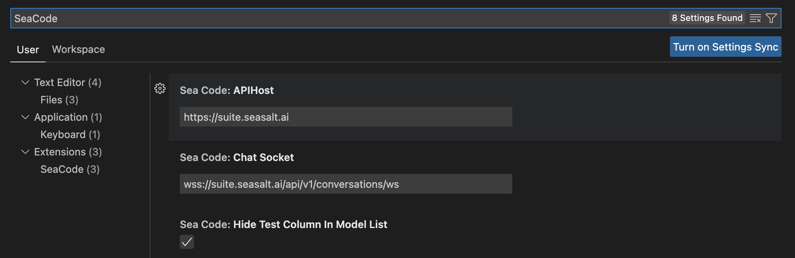

必須設定 ``Sea Code: APIHost`` 與 ``Sea Code:Chat Socket`` 兩個欄位，此兩欄位的用途如下面說明

1. ``Sea Code: APIHost`` 用來指定 SeaChat 的服務位於哪個網址，當 SeaCode 需要與服務互動時，會透過此設定呼叫 SeaChat 的 API。
2. ``Sea Code:Chat Socket`` 用來指定 SeaChat Web Socket 的網址，於 SeaCode 查詢對話紀錄與對話測試時，需透過此網址來建立通訊。

.. NOTE:: VSCode 的 Settings 支援 `User` 與 `Workspace` 兩個頁籤，分別代表這些設定是對怎樣的環境生效， `User` 表示目前 OS 登入的使用者所有的 VSCode 視窗都使用相同設定， `Workspace` 可依據於不同頁籤進行設定。

登入
---------------------------- 

完成設定後，於 VSCode 的左側選單，找到 SeaCode 的 icon 並點擊切換到 SeaCode 的操作介面， icon 長相如下圖

切換到 SeaCode 的介面後，第一次應該尚未登入，會看到類似下圖的畫面

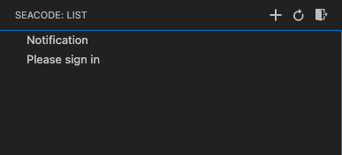

請點擊 ``Please sign in`` 點擊後，如果相關參數設定正確，就會開啟一個登入頁面如下圖所示

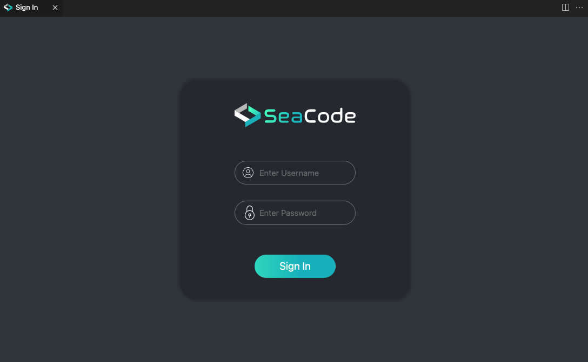

請於該頁面輸入 SeaChat 服務的帳號與密碼，如果未取得帳密需請管理員協助或於 SeaChat dashboard 新增使用者。
如果登入時發生錯誤，畫面右下角可以看到相關的錯誤提示，比如帳號與密碼錯誤時會看到下面的錯誤訊息

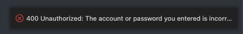

登入成功後，登入畫面會變成歡迎頁面如下圖所示

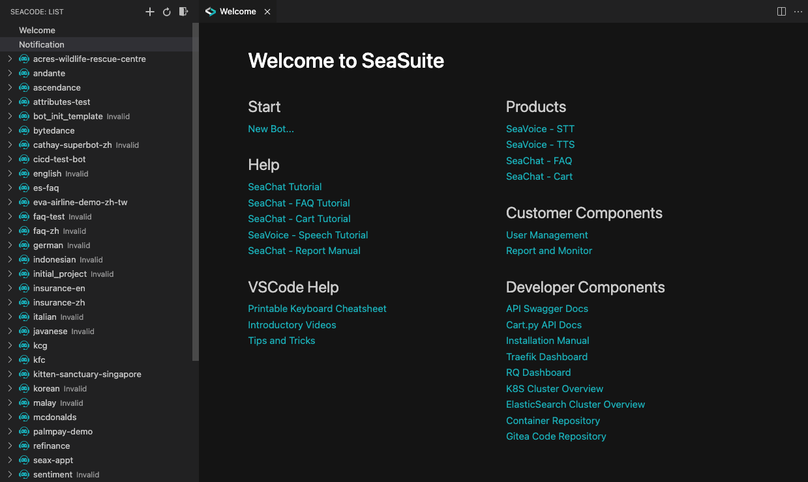

可以注意到畫面的左側出現了很多條列的項目，該處呈現的便是目前專案下所有機器人的列表，依據當前 SeaCode 環境開啟專案的內容呈現的機器人數量會有差異。

.. NOTE:: Welcome 頁面呈現的內容會因為連線到不同 SeaChat 環境而也差異，基於不同環境安裝的服務不同，呈現的連結會有增減。

新增聊天機器人
==============================

新增機器人與調整資料庫設定
-----------------------------

要新增一個聊天機器人，可透過 ``Welcome`` 頁面的 ``New Bot...`` 按鈕，或者 SeaCode 的機器人選單上方的 ``+`` 號來新增。
觸發任前述任一按鈕後，系統會詢問要將機器人設定到哪個目錄下，請選擇目前專案下的 ``bots`` 目錄。

選擇好目錄後，輸入機器人的名稱，系統將會開始建立機器人，完成後你可以到在專案目錄下將可以看到機器人相關的檔案

輸入機器人名稱

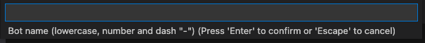

建立完成後的機器人目錄內容如下圖

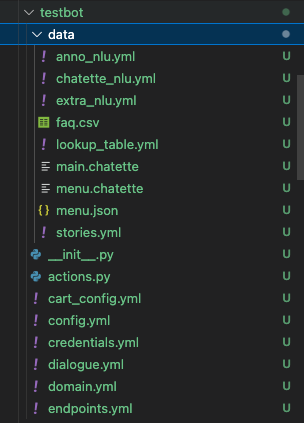

此份檔案內容是包含示範用的語料，直接就可以進行模型訓練與部署，不過針對部分資料庫的連線設定需要配合實際的狀況進行調整。
請點開 ``config.yml`` 檔案，該檔案有設定 ``es_indexing`` 用來宣告連線到 elasticsearch 的相關參數，包含 host,port,index_name,login,secret等，請依據實際狀況調整

下面為es_indexing簡單的設定範例：

.. code-block:: yaml

    es_indexing:
        analyzer: standard
        index_name: test_bot
        host: 10.10.100.10
        port: 9200
        login: username
        secret: password

此外為了記錄對話紀錄，也需要指定儲存對話紀錄的 Database，請於 ``endpoints.yml`` 檔案中增加設定，下面為簡單的設定範例：

.. code-block:: yaml

    tracker_store:
        type: SQL
        dialect: "postgresql"
        url: "127.0.0.1"
        port: 5432
        db: "test_bot"
        username: "postgres"
        password: "postgres"

註冊機器人
--------------------

到目前為止，我們進行的修正都是在自己本機的環境上進行的，SeaChat還不知道增加了一個機器人，要同步資料到 SeaChat 需進行下面步驟

Git Commit
~~~~~~~~~~~~~~~~~~~~~~~~~~
當要註冊機器人時，系統會檢查是否已經 簽入 Git，如果尚未簽入，SeaCode將不允許使用者註冊，請執行 ``git commit`` 將檔案簽入。

執行註冊
~~~~~~~~~~~~~~~~~~~~~~~~~

於SeaCode的機器人選單中，找到剛剛新增的機器人，應該會看到如下的畫面

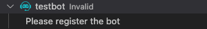

此時表示機器人尚未註冊，請按下 ``Please register the bot``，SeaCode將會向 SeaChat 註冊此機器人，並且於機器人的目錄下添加三個檔案。

註冊完成後查看機器人目錄，可以看到增加了下面三個檔案

1. ``.ngChat.bot`` 紀錄此機器人被配發的編號
2. ``bot.Dockerfile`` 於部署機器人時用來編譯 Docker Images
3. ``requirements.txt`` 指定機器人所需要的套件

再次 Commit 並 Push 
~~~~~~~~~~~~~~~~~~~~~~~~~

最後，由於註冊時SeaCode會自動添加檔案到機器人目錄下，因此需再次 ``git commit`` 將異動更新到 Git 上，並且為了確保 SeaCode 也能透過 Git 取得相關資料，需執行 ``git push``

訓練聊天機器人
==============================

完成新增與註冊機器人後，可以開始使用SeaCode的選單執行機器人的訓練，展開機器人的選單後，完整的功能列表如下圖所示：

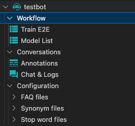

當游標移動到 Workflow 下的 ``Train E2E`` 時，會看到標題右方出現一個執行的按鈕如下圖紅色框框所標示：

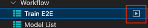

按下該按鈕後，機器人將開始進行訓練，此時 ``Train E2E`` 前面的 icon 會變成訓練中的圖示，一直等到訓練完成才會恢復原本的圖示。

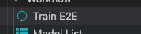

機器人的訓練所需的時間，依據語料的多寡以及選擇的模式會差異，可能需要數分鐘到數十分鐘之間，請耐心等候。訓練完成後，可於在 ``Model List`` 項目看到模型的列表，我們將在下一章節說明如何部署模型。

Model List 的功能
==============================

SeaCode的機器人選單中，當切換到 Workflow 下的 ``Model List`` 可以看到目前該機器人已經訓練好的所有版本的模型，畫面如下：

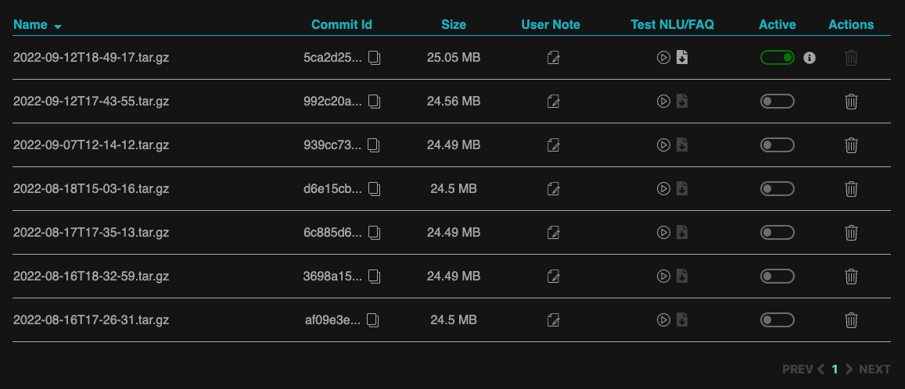

下面針資料欄位進行說明

1. Name: 模型儲存時的檔案名稱，系統會依據訓練的時間產生檔案名稱
2. Commit Id: 模型所使用的訓練資料是使用專案中那一份 commit 來進行訓練的，可使用此欄位查看訓練模型使用的資料為何。
3. Size: 訓練好後的模型檔案大小
4. User Note: 使用者紀錄，可用來編輯與顯示筆記，方便紀錄與區別此模型當初訓練時是否有什麼特殊事項
5. Test NlU/FAQ: 觸發SeaChat自訂評估模型的測試功能，測試完成後，可於此處下載測試結果
6. Active: 標示目前部署的模型並可切換部署版本
7. Actions: 其他操作，目前只有刪除功能，用來刪除模型

``Test NLU/FAQ`` 的功能
-------------------------------------

針對 ``Test NLU/FAQ`` 此欄位用來讓使用者能執行自動測試，並下載結果依據報告內容分析模型的效果，每個模型可以執行一次測試，完成後報告將儲存於 SeaChat 服務上，必要時可供使用者下載。

執行測試的方式是按下欄位中如下圖顯示的圖示

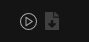

可以看到上圖中右側的下載圖案是 ``disabled`` 的，這是表示此模型尚未有測試報告，可以執行測試。開始測試時，上方圖示會變成下面圖片的樣子，表示目前正在測試中。

當測試完成後，下載圖示將變成可以下載的狀況，如下圖：

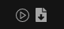

此時表示測試已經完成，可下載檔案後進行分析。

``Active`` 的功能
-------------------------------------
此欄位可用來判斷目前部署的模型是哪一個版本，並可切換模型版本以及停用機器人。

當圖示顯示如下圖時，表示此版本為部署的版本

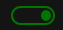

下圖則表示此版本未部署，可透過點擊按鈕來部署此版本

檔點擊某個未部署版本的圖示，系統將會開始切換部署版本，此時圖示將會變成閃動的綠色圖示如下圖所示

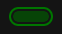

當閃爍結束，部署的版本將切換成指定的版本。

使用者也可將已部署的版本關閉，只要點擊已部署的icon即可，由於關閉已部署的模型表示將沒有其他模型提供服務，使用此功能需注意避免關閉了還需要使用的機器人。

Chat & Log 對話紀錄
=============================

於 ``Conversations`` 項目下，可以看到 ``Chat & Log`` 項目，切換到該項目後可以看到如下面圖片顯示的對話紀錄列表

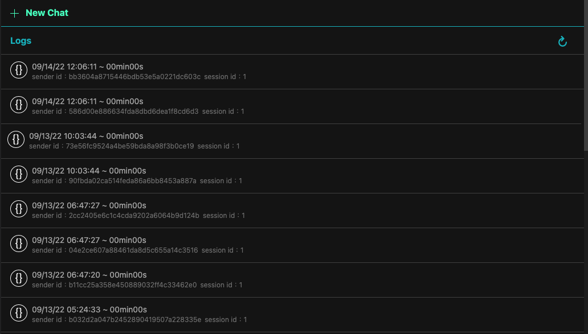

該列表會由新到舊列出機器人收到的對話，可透過向下捲動來查看更多對話

點擊任一則對話時，畫面將開啟分割視窗，呈現選擇的對話紀錄，如下圖所示

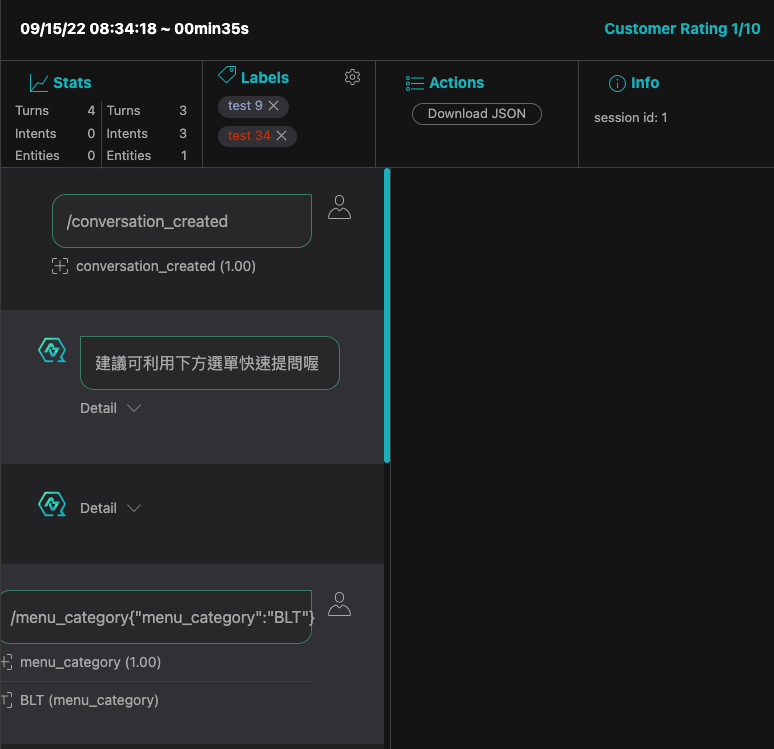

要看到每一句話詳細的資料，可以點選句對話，此時畫面會帶出機器人紀錄的當時對話資訊與 ``json`` 文件內容

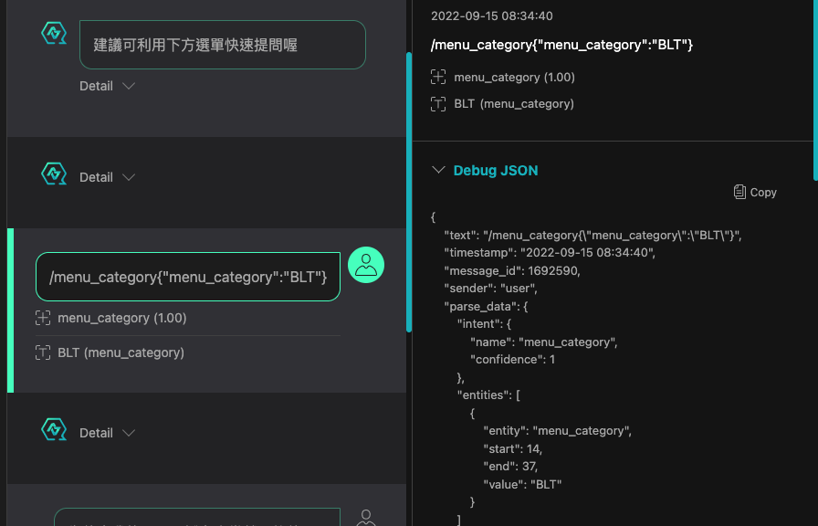

透過上面的資訊可用來判斷當下機器人為何會回覆該資訊，使用者可依據這些資訊進行機器人的優化。

FAQ files
=============================

SeaChat 提供 FAQ 功能，讓機器人透過簡單的訓練就能夠回答常見的問題，而相關語料可透過此功能檢視與修改。

於 ``Configuration`` 項目下，可以看到 ``FAQ files`` 項目，於選單展開 ``FAQ files`` 目錄下時，可以看到目前已經新增的 FAQ 語料檔，如下圖所示。

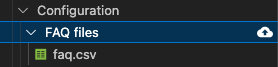

於上圖中 ``FAQ files`` 選項右側會出現一個上傳檔案的 icon，可以點擊該 icon 就可執行上傳 FAQ 檔案的功能。

而點選任何一個列表中的檔案，可檢視該檔案的內容於右側畫面中

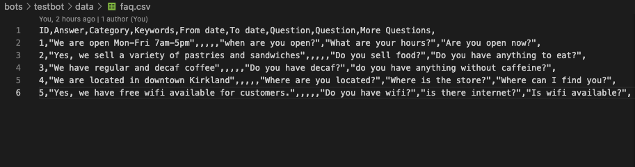

只需要在該畫面中編輯並儲存檔案，就可以更改 FAQ 的語料內容。
此外，於 SeaCode 選單功能也能下載與刪除 FAQ 檔案，當點選了 FAQ 檔案後，可以看到檔案右側有刪除與下載的圖示

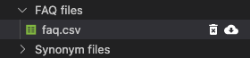

.. NOTE:: 不論是上傳檔案、刪除檔案或編輯檔案內容，要使變動生效就需要執行 git commit 與 git push，如此一來才能讓服務訓練模型時取得異動過後的資料。

最後說明一下 FAQ 檔案的規格， FAQ 檔案為一個 csv 檔，第一行必須是欄位標題，且不可任意變更，目前系統支援多個語系的標題，標題語系與訓練語料的語系無關
下面是不同語系支援的標題列表

``繁體中文``: ID,回答,類目,關鍵詞,開始日期,結束日期,問題,問題,更多問題
``簡體中文``: ID,答案,分类,关键词,开始日期,结束日期,问题,问题,更多问题
``英文``: ID,Answer,Category,Keywords,From date,To date,Question,Question,More Questions

個欄位的意義如下

1. ID: 語料的編號，數字欄位，請避免重複
2. 回答: 希望機器人回覆的答案
3. 分類: 問題分類，方便語料管理與維護
4. 關鍵詞: 用來標註FAQ項目的特徵，方便語料管理與維護
5. 開始日期: 此問句有效的時間，預設不限制
6. 結束日期: 此問句失效的時間，預設不限制
7. 問題: 用來訓練當使用者這樣問時希望回答此條FAQ的答案
8. 問題: 用來訓練當使用者這樣問時希望回答此條FAQ的答案
9. 更多問題: 用來訓練當使用者這樣問時希望回答此條FAQ的答案

7,8,9 三項功能是一樣的，都是用來填入訓練用的問法，依據需求可能有不止3句的狀況，此時使用 ``,``隔開填入更多問句即可，標題也一樣用 ``,`` 隔開表示有更多欄位即可

.. code-block::

    ID,回答,類目,關鍵詞,開始日期,結束日期,問題,問題,更多問題,,,
    1,"We are open Mon-Fri 7am-5pm",,,,,"when are you open?","What are your hours?","Are you open now?","open new","Is the store open?",

Synonym files 同義詞
=============================

於 ``Configuration`` 項目下，可以看到 ``Synonym files`` 項目，於選單展開 ``Synonym files`` 目錄下時，可以看到目前已經新增的同意詞檔案，如下圖所示。

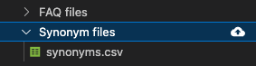

於上圖中 ``Synonym files`` 選項右側會出現一個上傳檔案的 icon，可以點擊該 icon 就可執行上傳 Synonym 檔案的功能。

而點選任何一個列表中的檔案，可檢視該檔案的內容於右側畫面中

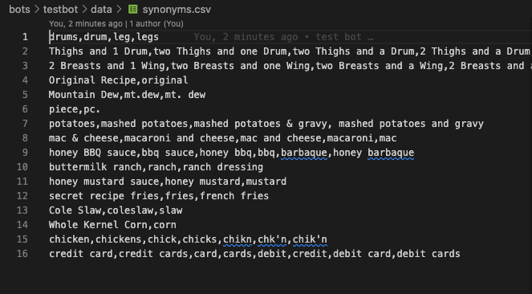

只需要在該畫面中編輯並儲存檔案，就可以更改同意詞表的內容。
此外，於 SeaCode 選單功能也能下載與刪除 Synonym 檔案，當點選了 Synonym 檔案後，可以看到檔案右側有刪除與下載的圖示

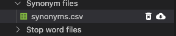

.. NOTE:: 不論是上傳檔案、刪除檔案或編輯檔案內容，要使變動生效就需要執行 git commit 與 git push，如此一來才能讓服務訓練模型時取得異動過後的資料。

Synonym 檔案為一個csv檔，裡面的每筆紀錄表示一列同意詞，不同詞彙以 ``,`` 隔開，當指定同意詞後，訓練出來的模型就會將同一列的詞彙視為相同意義的資料，可以讓單一問句透過同意詞置換應對更多不同的問法。
簡單的範例如下

.. code-block::

  drums,drum,leg,legs
  Original Recipe,original
  Mountain Dew,mt.dew,mt. dew

Stop word files 停用詞
=============================

於 ``Configuration`` 項目下，可以看到 ``Stop word files`` 項目，於選單展開 ``Stop word files`` 目錄下時，可以看到目前已經新增的同意詞檔案，如下圖所示。

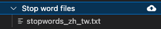

於上圖中 ``Stop word files`` 選項右側會出現一個上傳檔案的 icon，可以點擊該 icon 就可執行上傳 Stop word 檔案的功能。

而點選任何一個列表中的檔案，可檢視該檔案的內容於右側畫面中

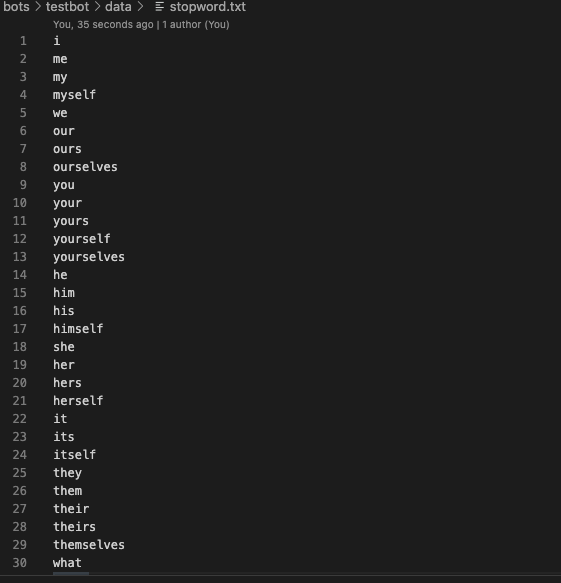

只需要在該畫面中編輯並儲存檔案，就可以更改同意詞表的內容。
此外，於 SeaCode 選單功能也能下載與刪除 Stop word 檔案，當點選了 Stop word 檔案後，可以看到檔案右側有刪除與下載的圖示

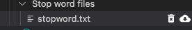

.. NOTE:: 不論是上傳檔案、刪除檔案或編輯檔案內容，要使變動生效就需要執行 git commit 與 git push，如此一來才能讓服務訓練模型時取得異動過後的資料。

Stop word 檔案為一個txt檔，裡面的每一行為一個字詞，模型載入停用詞以後，會忽略訓練語料以及使用者輸入文字中該列表中出現的字詞。
簡單的範例如下

.. code-block::
  
  i
  me
  my
  myself
  we
  our
  ours